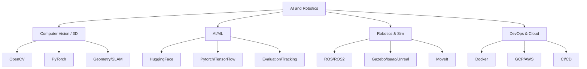

<h1 align="center">Rishikesh Jadhav</h1>

<!-- Animated typing tagline -->

  

  Designing simulation-driven perception systems and delivering reproducible, production-ready research that bridges lab to real-world robotics.

## Focus
- Visual learning and recognition, multi-view/3D vision, and robotics simulation
- Research-to-production: reproducibility, CI, datasets at scale, and reliable evaluation
- Cloud ML (GCP), containers, and tooling that makes experiments repeatable

## Currently
- Expanding expertise in Large Language Models (LLMs) and Vision-Language Models (VLMs) for robotics — enabling natural language-driven perception, planning, and simulation workflows  
- Preparing for Google Cloud's Professional ML Engineer certification by building ML projects on GCP

## Featured Projects

<table>
  <tr>
    <td width="50%">
      <h3 align="center">Birds-Eye-View Trajectory Prediction</h3>
      

        
        

          
          
        

        
<strong> IoU: 0.920 | VPQ: +15% | ViT Integration</strong>

      

    </td>
    <td width="50%">
      <h3 align="center">ARIAC 2023: Agile Robotics</h3>
      

        
        

          
          
        

        
<strong> Team Lead | 8% Faster | 40% Cost Reduction</strong>

      

    </td>
  </tr>
  <tr>
    <td width="50%">
      <h3 align="center">3D Indoor Mapping & Segmentation</h3>
      

        
        

          
          
        

        
<strong> 93% Accuracy | 7% Faster | 12% Quality Boost</strong>

      

    </td>
    <td width="50%">
      <h3 align="center">Point Cloud Segmentation</h3>
      

        
        

          
          
        

        
<strong> 97.79% Classification | 88.84% Segmentation | 50ms Inference</strong>

      

    </td>
  </tr>
</table>

## Skills

**Programming Languages:**  
Python, C++, Bash, MATLAB, SQL  

  
  
  
  
  

**AI / ML Frameworks & Scientific Computing:**  
PyTorch, TensorFlow, Keras, HuggingFace, OpenCV, NumPy, Pandas, Matplotlib, SciPy, Scikit-learn  

  
  
  
  
  
  
  
  
  
  

**Robotics & Simulation:**  
ROS, ROS2, Gazebo, MoveIt, Isaac Sim, Falcon(Duality AI), Unreal Engine  

  
  
  

**DevOps & Cloud:**  
Linux, Git, Docker, Google Cloud, AWS, Jenkins  

  
  
  
  
  

## How I Work
- **Simulation-first mindset** - design, validate, and iterate in high-fidelity environments before hitting real hardware, saving time and cost  
- **Research-to-production flow** - every project ships with reproducible environments, fixed seeds, and exact dataset/weights versions  
- **Engineering discipline** - CI/CD pipelines with linting, type checks, unit/integration tests, and automated benchmarks  
- **Storytelling through results** - architecture diagrams, quantitative comparisons, and demo videos to make work easy to understand and trust  
- **Scalable experimentation** - containerized ML workflows on cloud (GCP) with distributed training and evaluation  
- **Clean handoffs** - well-documented code, versioned changelogs, and minimal setup friction so others can run it end-to-end  
- **Toolsmithing** - build or adapt tools (simulation assets, dataset converters, visualization utilities) to speed up team velocity  
- **Bias for impact** - prioritize work that reduces friction for downstream teams and pushes projects closer to deployment  

## Metrics

  
  

## Tech stack visualization

## Let's Connect

  
  
  

